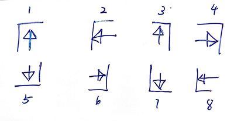

ntu.sce.mdp.15
==============
TO BE THE FASTEST.  
Swifter, stronger, and more precise.  

Arduino Requirements
==============
2 spaces as tab  

PololuWheelEncoder is using ISR(PCINT0_vect), interrupt Service Routine  
!important Avoid Serial printing in Polling
abs() in Arduino has adverse effect; thus do not use it on function's return value  

NAMING CONVENTION  
method_name  
functionName  

Library Dependencies:  
--------------
* Servo.h   
* SharpIR.h  
* DualVNH5019MotorShield.h  
* PololuWheelEncoders.h (and all its dependent libraries as in [this repo](https://github.com/pololu/libpololu-avr/tree/master/src))  
* PID_v1.h
* HMC5883L.h 
* PinChangeInt.h  

All available in /arduino_motor/libraries
Communication
--------------
###Machine Code
Command to be executed is using 7-digit machine code since it saves memory on Arduino;
```python
# in Python
machine_code = "xxxxxxx"
machine_code[0:2] # constructs 2-digit function codes  
machine_code[2:7] # constructs parameter with 2 decimal places
```  
example:  
```python
"0012312"
```
This code is translated into function code 00 with parameter 123.12  
The example commands Arduino to moveForwad by 123.12 cm.  
List of function codes currently available:  
```
00: void moveForward(double dist);  
01: void turnLeft(double angle);  
02: void turnRight(double angle);  

10: void getSensorReadings(); // ad-hoc request for sensor readings (ad-hoc).

20: moveForward with Sensor Reading (returns two packages of data)
21: turnLeft with Sensor Reading
22: turnRight with Sensor Reading

98: void calibrate(int situation); // see calibration section below
```
NOTICE: In python each json serial command at very end must end with 
```python
'\n'
```
NOTICE: incoming serial buffer size of Arduino is limited, thus only 7 concurrent machine code command is allowed  
###PC Message
```json
{  
  "function": function_code,  
  "parameter": parameter  
}  
```
###Feedback  
Json format ([Python Reference](http://docs.python.org/2/library/json.html))  
```json
{  
  "function": function_code,  
  "status": status_code  
}  
```
example:
```json
{"function": 0, "status": 200}  
```
status_code is the HTTP status code as in [this](http://www.w3.org/Protocols/rfc2616/rfc2616-sec10.html).  
The most common status code is 200 (i.e. OK).  
@Deprecated
```json
{"function": 99, "status": 200}  
```
@Deprecated 99 denotes the Arduino is ready to do serial communication  
###Sensor Readings  
In the case you don't know json array, refer to [this](http://stackoverflow.com/questions/10973614/convert-json-array-to-python-list) and [this](http://www.w3schools.com/json/json_syntax.asp).  
```json
{ 
  "sensors": [
    {"sensor": sensor_code,  "value": return_value},
    {"sensor": sensor_code,  "value": return_value},
    {"sensor": sensor_code,  "value": return_value},
    {"sensor": sensor_code,  "value": return_value},
    {"sensor": sensor_code,  "value": return_value},
    {"sensor": sensor_code,  "value": return_value}
  ]
}  
```
This json array indicates obstacle distances (in cm) from front, left, right. The distances are from periphery of the robot.  
Example  
```json
{"sensors":[{"sensor":0,"value":30},{"sensor":1,"value":30},{"sensor":2,"value":30},{"sensor":3,"value":30},{"sensor":10,"value":100},{"sensor":11,"value":100}]}
```
List of sensor codes currently available:  
```
0: front left sensor;   
1: front right sensor;  
2: front center sensor;  
3: sided right sensor; 
10: sided left ultra sensor;  
11: sided right ultra sensor; 
```
Notice: if the distance is beyond the sensor's range, it will return -1;  
###Calibration
98: void calibrate(int situation);  
####To determine the situation
  
Wall vs. Robot Orientation.  
The situation is numbering as above to invoke function void calibrate(int situation)  

